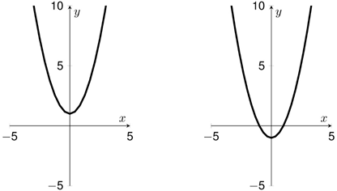

# 第二章 代数的魔力

## **有魔力的介绍**

        我的代数启蒙来自于我的父亲。在我很小的时候，他曾对我说：“儿子，代数就像算术一样，只是用字母替换数。例如，2x + 3x = 5x和3y + 6y = 9y。你知道了吗？”我说：“我是这么认为的。”他说：“好的，那么5Q + 5Q是什么？”我自信地说，“10Q。”他说：“我听不到你。你能说得更响吗？”于是我喊道：“TenQ！”他说：“不客气！”（相比教我数学，我父亲对双关语，笑话和故事更感兴趣，所以我应该从一开始就怀疑他是否真得没听见！）

       我第二次与代数相关的经历是试图明白下面的魔术：

1.  在1和10之间想一个数（你可以选择更大的数）
2.  将这个数加倍
3.   再加上10
4.   现在除以2
5.   现在减去最初你想到的那个数

       我相信你会想到结果是5，对吗？

       这个魔术背后的秘密是什么呢？代数。让我们一步步的揭秘这个魔术。我并不知道你最初所选择的数，所以让我们用N来指代它。当我们用一个字母来代替一个数时，这个字母被称为变量。

       第二步中，你将这个数加倍，所以现在这个数是2N（我们通常避免使用乘号，特别是在x被经常作为变量来使用时）。第三步之后，你的数变成了2N + 10。第四步，我们进行了除2操作，因此得到的结果是N + 5。最后，我们减去原始的数N。这样最后只有5留下来。我们可以将以上步骤总结在下表中

| **第一步** | **N** |
| :--- | :--- |
| **第二步** | 2N |
| **第三步** | 2N+10 |
| **第四步** | N+5 |
| **第五步** | N+5-N |
| **答案** | 5 |

## **代数规则**

       让我们从一个迷开始本节。找到一个数，这个数一旦被加上5就会变成原来的三倍。

       为了解这个迷，让我们把这个未知数称为x。加上5的结果是x + 5。初始值变成3倍记为3x。我们希望这些数相等，因此便得到等式

$$
3x = x + 5
$$

       如果我们在等式左右两端各减去一个x，则得到

$$
2x = 5
$$

       \(2x从哪里得到的呢？3x - x等同于3x - 1x，所以结果是2x）。将等式两边分别除以2，我们得到

$$
x = 5/2 = 2.5
$$

       我们可以验证这个答案是对的。

$$
2.5 + 5 = 7.5 = 3 × 2.5
$$



  
代数还可以帮助我们理解另外一个技巧。从高位依次递减写下一个三位数，譬如842或951。然后将这个数头尾颠倒产生一个新的数。用你写下的第一个数减第二个数（译注：第二个数肯定小于第一个数）。将得到的差与其头尾颠倒后的结果加起来。让我们以853为例说明计算过程  
  
当换个数时，结果是什么呢？值得注意的是，只要你按照以上的步骤去做，你最终都会得到1089！这是为什么呢？

让代数来帮忙解决问题吧！假设我们最初的数是abc（这里a &gt; b &gt; c）。如同 $$853 = (8 × 100) + (5 × 10) + 3$$ ，abc的值是 $$100a + 10b + c$$ 。当我们将这个数的高低位颠倒，我们得到cba，它的值是 $$100c + 10b + a$$ 。两数相减，我们得到   $$\begin{aligned}   &(100a + 10b + c) − (100c + 10b + a) \\ = &(100a − a) + (10b − 10b ) + (c − 100c) \\ = &99a − 99c\\ = &99(a − c) \end{aligned}$$

 换句话说，差值是99的倍数。既然原始数的各位依次递减，a - c就肯定不会小于2，即差值可能是2、 3、 4、 5、 6、 7、 8或者9。这样，两个数的差值必然是这些数中的一个：198、297、396、495、594、693、792、 891。

无论差值是其中的哪一个，当我们将它和它的颠倒数相加时，我们都会得到相同的结果1089。

198 + 891 = 297 + 792 = 396 + 693 = 495 + 594 = 1089


       刚刚看到的这些被我称为代数的黄金法则：**等号两边做相同的操作，等式依然成立**。

       譬如，如果你想求解以下方程式中的x

$$
3(2x + 10) = 90
$$

       我们的目标是将x分离出来。让我们首先在等式两边各除以3，这样等式简化为

$$
2x + 10 = 30
$$

       下一步，通过两边各减去10，将等号左边的10消去。

$$
2x = 20
$$

       最后，等式两边各除以2，这样等式被简化为

$$
x = 10
$$

       最好我们能检查一下结果。现在 $$x = 10，3(2x + 10) = 3(30) = 90$$ ，我们的结果是对的。还有没有其它的结果呢？没有，因为x的值必须使得过程中每一个等式都成立。所以x = 10是唯一的解。

       现在有一个现实生活中的代数问题。纽约时报在2014年曾报道：Sony公司的电影《The interview》（译注：刺杀鑫）在发行后的前4天内产生了1500万美元的在线租售额。Sony公司并未透露这一数值中有多少来自在线销售（单价15美元）和多少来自在线租赁（单价6美元）。但该公司表示，总共约有200万笔交易。为解决记者的问题，让我们用S表示在线销售的量，用R表示在线租赁的量。既然有2百万的交易量。那么

$$
S + R = 2,000,000
$$

       既然总的在线销售的单价是15美元，在线租赁的单价是6美元，因此总销售额满足

$$
15S + 6R = 15,000,000
$$

       由第一个等式，我们得出R = 2,000,000 − S。这样我们可以将第二个等式改写为

$$
15S + 6(2,000,000 − S) = 15,000,000
$$

       相当于 $$15S + 12,000,000 − 6S = 15,000,000$$ ，这里只有一个变量S。重新整理之后，等式变成

$$
9S + 12,000,000 = 15,000,000
$$

       等号两边同时减去12,000,000

$$
9S = 3,000,000
$$

       因此，可见S是100万的三分之一。S ≈ 333,333，所以 $$R = 2,000,000 − S ≈ 1,666,667$$ （检查：总销售额 $$$15 × (333,333) + $6 × (1,666,667) ≈ $15,000,000$$ ）。

       是时候来讨论我们一直在使用却未被提及的一条规则了——**分配率**。这一规则能够使得加法和乘法能够很好地在一起工作。分配率的形式如下，对任意数A、 b、 c，

$$
A(b + c) = Ab + Ac
$$

       我们做一位数与两位数乘法时，应用的就是这一规则。

$$
7 × 28 = 7 × (20 + 8) = (7 × 20) + (7 × 8) = 140 + 56 = 196
$$

       当我们以计数的情景为例时，这一规则就会比较好理解。假设我有7袋硬币，每袋中有金币20枚和银币8枚。总共用多少枚硬币？换句话说，每袋有28枚硬币，因此总量是 $$7 × 28$$ 。我们也可以这样算，总共有金币 $$7 × 20$$ 枚，银币 $$7 × 8 $$ 枚。总量是 $$(7 × 20) + (7 × 8)$$ 。因此， $$7 × 28 = (7 × 20) + (7 × 8)$$ 。

       你也可以在求正方形面积时见识到分配率。

       矩形的面积是 A\(b + c\)。我们可见矩形被分割成两部分，左侧的面积是Ab，右侧的面积是Ac，因此组合的部分是Ab + Ac。这个例子说明了当A、b、c是正数时的分配率。

       我们有时会将分配率同时应用到数和变量。如

$$
3(2x + 7) = 6x + 21
$$

       当我们从左往右读这个等式时，它可以被解释为3乘以2x+7的一种方法。当我们从右往左读这个等式时，它可以被视为一种对6x + 21进行因式分解的方法（3被从6x和21中提取出来）。



  
为什么两个负数相乘会得到一个正数？例如， $$(−5) × (−7) = 35$$ 。老师们会用很多方法来解释，从“债务抵消”到“这就是如此”。但是真正的原因是：我们希望分配率能对所有的数起作用，而不仅仅是正数。如果你希望分配率能对负数和0起作用，你必须接受这样的后果。让我们看看为什么。

假设你接受了这样 的事实 $$−5 × 0 = 0 $$ 和 $$ −5 × 7 = −35$$ （这些同样可以使用我们即将使用的方法证明，但大多数人喜欢视它们为真理）。现在，我们求下面表达式的值

$$−5 × (−7 + 7)$$ 

它等于多少呢？一方面，这个表达式其实就是 $$−5 × 0$$ ，我们知道结果是0。另一方面，使用分配率，表达式也可写成 $$((−5) × (−7)) + (−5 × 7)$$ 。

接下来

$$((−5) × (−7)) + (−5 × 7) = ((−5) × (−7)) − 35 = 0$$ 

既然 $$((−5) × (−7)) − 35 = 0$$ ，我们必须强制 $$(−5) × (−7) = 35$$ 。总而言之，是分配率确保了 $$(−a) × (−b) = ab $$ 对所有的数都成立。


## **FOIL的魔力**

       分配率的一个最重要的推论是代数的**FOIL**规则。

       对_A_、 _b_、_c_、 _d_四个变量 $$(A + b)(c + d) = Ac + Ad + bc + bd$$ 

       FOIL分别对应**F**irst-**O**uter-**I**nner-**L**Ast四个单词。Ac是表达式\(A + b\)\(c + d\) 的第一组（First），Ad是最外侧的一组（Outer），bc是最内侧的一组（Inner），bd是最后一组（LAst）。

       让我们以两个数为例来说明FOIL规则

$$
\begin{aligned}
23 × 45 &= (20 + 3)(40 + 5) \\
  &= (20 × 40) + (20 × 5) + (3 × 40) + (3 × 5) \\
            &= 800 + 100 + 120 + 15 \\
             &= 1035
\end{aligned}
$$

       有一个关于FOIL的神奇应用。按照下表中的指示掷两粒骰子。假设第一个骰子6朝上，第二个骰子是3朝上。那么被遮盖住的则分别是1和4.

| **掷两颗色子（假设得到6和3）** |  |  |
| :--- | :--- | :--- |
| **将得到的两个数相乘** | 6 × 3 = 18 |  |
| **将对面的两个数相乘** | 1 × 4 = 4 |  |
| **将第一个面和第二个底相乘** | 6 × 4 = 24 |  |
| **将第二个面和第一个底相乘** | 1 × 3 = 3 |  |
| **乘积的总和** |  | 49 |
|  |  |  |


为什么FOIL起作用？通过分配率（先写加的部分）我们得到

$$(a + b)e = ae + be$$ 

现在当我们将e替换成c + d，我们得到

$$(a + b)(c + d) = a(c + d) + b(c + d) = ac + ad + bc + bd$$ 

最后的一个等式来自于分配率的应用。如果你更喜欢几何参数的话（a, b, c, d均是正数），请使用两种方法找出下面矩形的面积。

 

我们可以直接算出大矩形的面积 \(a + b\)\(c + d\)。也可以先算四块较小矩形的面积ac、ad、bc和bd，然后将它们加起来ac + ad + bc + bd。把这两个面积等同起来就得到了FOIL。


        在这个例子中，最终的和是49。当你亲自尝试时，无论两个骰子掷的情况如何，你都将得到同样的结果。这是因为，骰子相对两面点数之和是7。所以，如果骰子向上的一面是x或y，则底部为7 - x或7 -  y。使用代数，我们的表将变成这样

| **掷两颗色子（假设得到x和y）** |  |  |
| :--- | :--- | :--- |
| **将得到的两个数相乘** | x y = xy |  |
| **将对面的两个数相乘** | \(7 - x\)\(7 - y\) = 49 – 7y -7x +xy |  |
| **将第一个面和第二个底相乘** | x\(7 – y\) = 7x - xy |  |
| **将第二个面和第一个底相乘** | y\(7 – x\) = 7y - xy |  |
| **乘积的总和** |  | 49 |
|  |  |  |

       请注意在第三行，我们是如何使用FOIL的（-x和-y相乘得xy）。观察表中的第二列，我们可以少一些代数运算而直接得到49。第二列中的4项，正是 \(x + \(7 − x\)\)\(y + \(7 − y\)\) 按照FOIL规则展开后的四项，我们还可以这么计算\(x + \(7 − x\)\)\(y + \(7 − y\)\) = 7 × 7 = 49。

       在多数代数课中，FOIL主要被用来展开类似的乘法表达式。

$$
(x + 3)(x + 4)= x2 + 4x + 3x + 12 = x2 + 7x + 12
$$

       请注意，在最后的表达式中，7（被称为x的系数）等于3 + 4。最后一个数12等于3 × 4。通过一些练习，你可以很快得到结果。譬如，由 5 + 7 = 12 和 5 × 7 = 35, 我们能立即得到

$$
(x + 5)(x + 7) = x2 + 12x + 35
$$

       对于负数以上的方法依然奏效。下面第一个例子中

$$
\begin{aligned}
6 + (−2) = 4，&  6 × (−2) = −12 \\
(x + 6)(x − 2) &= x2 + 4x − 12 \\
(x + 1)(x − 8) &= x2 − 7x − 8 \\
(x − 5)(x − 7) &= x2 − 12x + 35
\end{aligned}
$$

       下面例子中括弧内的数相同

$$
\begin{aligned}
(x + 5)^2 = (x + 5)(x + 5) = x^2 + 10x + 25 \\
(x − 5)^2 = (x − 5)(x − 5) = x^2 − 10x + 25
\end{aligned}
$$

       请特别注意， $$(x + 5)^2 ≠ x^2 + 25$$ 。这是一个代数初学者经常会犯的错误。另一方面，当括弧内两个数正负相反时，结果会比较有趣。

$$
(x + 5)(x − 5) = x^2 + 5x − 5x − 25 = x^2 − 25
$$

       通常情况下，这是平方差公式，请务必记住它

$$
(x + y)(x − y) = x^2 − y^2
$$

       在第一章中，我们求一个数平方的快速算法就是利用了这一公式。该方法基于下面的代数式。

$$
A^2 = (A + d)(A − d) + d^2
$$

       让我们来验证这一公式。根据平方差公式，我们看到 $$[(A + d)(A − d)] + d^2 = [A^2 − d^2] + d^2 = A^2$$ 。这样该公式对所有A 和 d都成立。在我们的应用中，A就是被平方的数。d则是A和易于求平方的数的差值。例如求97的平方时，d = 3。

$$
\begin{aligned}
972 &= (97 + 3)(97 − 3) + 32 \\
          &= (100 × 94) + 9 \\
      &= 9409
\end{aligned}
$$



  
现在用一组图片来证明平方差定律。这组图片说明了如何将一个面积为x2 − y2的图形分割重组成一个面积为\(x + y\)\(x − y\)的正方形。

 


       在第一章中，我们学习了一种速算法，它可以求两个接近的数的乘积。我们关注的是接近100或者最高位相等的数，一旦我们懂得了其后的代数知识，我们便可以将这种算法应用到更多的场景。下面的代数式说明了**接近法**背后的代数知识。

$$
\begin{aligned}
(z + A)(z + b) &= z(z + A + b) + Ab \\
&= z^2 + zb + zA + Ab
\end{aligned}
$$

        我们可以把z从前三项中提取出来，这样就得到了上面的公式。这一公式对任意数都成立。通常情况下，我们选取的z都是整十数。例如43 × 48，我们让z = 40, A = 3, b = 8。这样我们的公式使我们得到。

$$
\begin{aligned}
43 × 48 &= (40 + 3)(40 + 8) \\
             &= 40(40 + 3 + 8) + (3 × 8) \\
             &= (40 × 51) + (3 × 8)\\
             &= 2040 + 24\\
             &= 2064
\end{aligned}
$$

       注意相乘的两个数之和43 + 48 = 91，容易相乘的两个数具有相同的和40 + 51 = 91。这并非巧合，因为代数告诉我们初始的两个数之和为 \(z + A\) + \(z + b\) = 2z + A+ b，容易相乘的两个数 z 和 z + A + b具有相同的和。我们也可以同时将两个数凑成整十数，例如，上面的例子可以这么计算，令 z = 50，A = −7,  b = −2，这样首先完成的计算就是50 × 41（43 + 48 = 91 = 50 + 41）。这样，新的计算过程如下

$$
\begin{aligned}
43 × 48 &= (50 − 7)(50 − 2)\\
             &= (50 × 41) + (−7×−2)\\
              &= 2050 + 14\\
              &= 2064
\end{aligned}
$$


<table>
  <thead>
    <tr>
      <th style="text-align:left">
        
&#x7B2C;&#x4E00;&#x7AE0;&#x4E2D;&#xFF0C;&#x6211;&#x4EEC;&#x4ECB;&#x7ECD;&#x4E86;&#x5982;&#x4F55;&#x5FEB;&#x901F;&#x6C42;&#x4E24;&#x4E2A;&#x5927;&#x4E8E;100&#x7684;&#x6570;&#x7684;&#x79EF;&#x3002;&#x8FD9;&#x4E00;&#x65B9;&#x6CD5;&#x540C;&#x6837;&#x9002;&#x7528;&#x4E8E;&#x5C0F;&#x4E8E;100&#x7684;&#x6570;&#x3002;

        
96 &#xD7; 97 = (100 &#x2212; 4)(100 &#x2212; 3)

        
= (100 &#xD7; 93) + (&#x2212;4&#xD7;&#x2212;3)

        
= 9300 + 12

        
= 9312

        
&#x6CE8;&#x610F;96 + 97 = 193 = 100 + 93&#xFF08;&#x5B9E;&#x9645;&#x5E94;&#x7528;&#x4E2D;&#xFF0C;&#x6211;&#x53EA;&#x662F;&#x5C06;&#x6700;&#x4F4E;&#x4F4D;&#x76F8;&#x52A0;6+7=13&#x4FBF;&#x53EF;&#x77E5;100&#x5C06;&#x4F1A;&#x548C;93&#x76F8;&#x4E58;&#xFF09;&#x3002;&#x540C;&#x6837;&#xFF0C;&#x4E00;&#x65E6;&#x4F60;&#x638C;&#x63E1;&#x4E86;&#x5B83;&#x7684;&#x7A8D;&#x95E8;&#xFF0C;&#x4F60;&#x5C31;&#x4E0D;&#x7528;&#x5C06;&#x4E24;&#x4E2A;&#x8D1F;&#x6570;&#x76F8;&#x4E58;&#xFF0C;&#x53EA;&#x9700;&#x5C06;&#x5B83;&#x4EEC;&#x7684;&#x6B63;&#x503C;&#x76F8;&#x4E58;&#x5373;&#x53EF;&#x3002;&#x4F8B;&#x5982;

        
97 &#xD7; 87 = (100 &#x2212; 3)(100 &#x2212; 13)

        
= (100 &#xD7; 84) + (3 &#xD7; 13)

        
= 8400 + 39

        
= 8439

        
&#x8FD9;&#x4E00;&#x65B9;&#x6CD5;&#x540C;&#x6837;&#x9002;&#x7528;&#x76F8;&#x5BF9;100&#x4E00;&#x5927;&#x4E00;&#x5C0F;&#x7684;&#x60C5;&#x51B5;&#xFF0C;&#x4F46;&#x662F;&#x6700;&#x540E;&#x4E00;&#x6B65;&#x53D8;&#x6210;&#x4E86;&#x51CF;&#x6CD5;&#x3002;&#x4F8B;&#x5982;

        
109 &#xD7; 93 = (100 + 9)(100 &#x2212; 7)

        
= (100 &#xD7; 102) &#x2212; (9 &#xD7; 7)

        
= 10,200 &#x2212; 63

        
= 10,137

        
102 = 109 &#x2212; 7 = 93 + 9 = 109 + 93 &#x2212; 100&#xFF08;&#x53EA;&#x9700;&#x8981;&#x5C06;&#x6700;&#x4F4E;&#x4F4D;&#x76F8;&#x52A0;&#xFF0C;9
          + 3&#x544A;&#x8BC9;&#x6211;&#x4EEC;&#x53E6;&#x4E00;&#x4E2A;&#x6570;&#x4E2A;&#x4F4D;&#x662F;2&#xFF0C;&#x6211;&#x4EEC;&#x4FBF;&#x53EF;&#x77E5;&#x53E6;&#x4E00;&#x4E2A;&#x56E0;&#x6570;&#x662F;102&#xFF09;&#x3002;&#x901A;&#x8FC7;&#x7EC3;&#x4E60;&#xFF0C;&#x4F60;&#x80FD;&#x591F;&#x4F7F;&#x7528;&#x8FD9;&#x4E00;&#x65B9;&#x6CD5;&#x6C42;&#x4EFB;&#x610F;&#x4E24;&#x4E2A;&#x63A5;&#x8FD1;&#x7684;&#x6570;&#x7684;&#x4E58;&#x79EF;&#x3002;&#x6211;&#x5C06;&#x4E3E;&#x4E00;&#x4E9B;3&#x4F4D;&#x6570;&#x7684;&#x4F8B;&#x5B50;&#x3002;&#x6CE8;&#x610F;&#xFF0C;a&#x548C;b&#x73B0;&#x5728;&#x4E0D;&#x662F;&#x4E00;&#x4F4D;&#x6570;&#x4E86;&#x3002;

        
218 &#xD7; 211 = (200 + 18)(200 + 11)

        
= (200 &#xD7; 229) + (18 &#xD7; 11)

        
= 45,800 + 198

        
= 45,998

        
985 &#xD7; 978 = (1000 &#x2212; 15)(1000 &#x2212; 22)

        
= (1000 &#xD7; 963) + (15 &#xD7; 22)

        
= 963,000 + 330

      </th>
    </tr>
  </thead>
  <tbody></tbody>
</table>


## **求未知数x**

       本章较早时候，我们看到了使用代数黄金法则求解方程式的例子。当方程中只包含一个变量（比如x）且方程是线性的（这意味着它们可以包含数或者x的倍数，但没有比这更复杂的项，比如x2），它就比较容易解。例如，要解这个方程

$$
9x − 7 = 47
$$

       我们可以在方程式两边加上7得到9x = 54，接着两边除以9得到 x = 6。

       或者一个稍稍复杂点的方程：

$$
5x + 11 = 2x + 18
$$

       我们通过在方程式两边同时减去2x和11使得方程式被简化为3x = 7。这一方程式的解是 x = 7/3。任何线性方程最终都可以被简化成的形式Ax = b \(or Ax − b = 0\) ，其中x = b/A（假设A≠ 0）。

       对于二次方程（ 因为x2 的出现）情况则变得更加复杂。最容易解的二次方程类似于

$$
x^2 = 9
$$

       这个方程有两个解 x = 3 和 x = −3。当方程式的右边不是一个平方数时，如

$$
x^2 = 10
$$

       我们有两个解 $$x=\sqrt{10} = 3.16...$$ 和 $$x=\sqrt{10} = -3.16...$$ 。一般对n &gt; 0，我们称 $$\sqrt{n}$$ 为n的平方根，表示一个平方为n的正数。当n不是一个平方数时， $$\sqrt{n}$$ 通常情况可由计算器得出。



| 方程式x2 = −9的解是多少？目前，我们说它无解。事实上没有平方为-9的实数。但是在第10章，我们将看到这个方程有两个解x = 3i and x = −3i，这里i是平方为-1的虚数。如果这听起来不可能且很荒谬，没关系。但是在生活中，负数似乎也是不可能的（一个数怎么会小于0呢？）。你只要以正确的方式看看数就可以理解这些。 |
| :--- |


       因为4x的存在，方程式 $$x^2 + 4x = 12$$ 解起来会比较麻烦，但是不同的解法还是有的。正如心算一样，解决这一问题的方法不止一种。

       我尝试的第一个方法是因式分解法。第一步是将所有的项移到方程式的左边，这样右边只剩下0。这样方程式变成了

$$
x^2 + 4x − 12 = 0
$$

       现在该怎么办呢？好吧，幸运的是，在刚刚结束的一节中，在我们练习FOIL规则的时候，我们看到了 $$x^2 + 4x − 12 = (x + 6)(x − 2)$$ 。这样，我们把问题转化为 $$(x + 6)(x − 2) = 0$$ 。

       两个因数相乘结果为0的唯一原因是其中至少一个因数为0。因此，我们得到x + 6 = 0 或者 x − 2 = 0。进一步得出x = −6 或 x = 2

       你可以验证这两个结果就是本题的解。

       根据FOIL， $$(x + A)(x + b) = x^2 + (A + b) x + Ab$$ 。这使得分解一个一元二次方程有些像解谜语。比如在刚刚的例子中，我们必须找出两个数，它们的和是4积是-12。答案A = 6 和 b = −2是我们想要的结果。请尝试分解 $$x^2 + 11x + 24$$ 。这个谜语是：找出两个和为11积为24的数。既然3和8满足这一要求，我们得到 $$x^2 + 11x + 24 = (x + 3)(x + 8)$$ 。

       现在假设我们拥有方程式 $$x^2 + 9x = −13$$ 。分解 $$x^2 + 9x +13$$ 并不容易。但是不要害怕！在这种情况下，我们可以使用一元二次方程的求根公式。

       对于方程 $$ax^2 + bx + c = 0$$ ，它的解是

$$
x=\frac{-b\pm\sqrt{b^2-4ac}}{2a}
$$

       这里符号‘±’表示“加或者减”。以 $$x^2 + 4x − 12 = 0$$ 为例，我们有A = 1、b = 4和c = −12。

       求根公式告诉我们，该方程式的解是

$$
x=\frac{-4\pm\sqrt{16-4(1)(-12)}}{2}=\frac{-4\pm\sqrt{64}}{2}=\frac{-4\pm8}{2}=-2\pm4
$$

       根据需要x = −2 + 4 = 2 或 x = −2 − 4 = −6。我想你也会觉得用因式分解法解方程比较直接。



<table>
  <thead>
    <tr>
      <th style="text-align:left">
        
&#x53E6;&#x4E00;&#x4E2A;&#x4E00;&#x5143;&#x4E8C;&#x6B21;&#x65B9;&#x7A0B;&#x7684;&#x89E3;&#x6CD5;&#x662F;&#x51D1;&#x5E73;&#x65B9;&#x6CD5;&#x3002;&#x5728;&#x65B9;&#x7A0B;&#x5F0F;x2
          + 4x = 12&#x4E24;&#x8FB9;&#x90FD;&#x52A0;&#x4E0A;4&#x3002;

        
x2 + 4x + 4 = 16

        
&#x8FD9;&#x6837;&#x65B9;&#x7A0B;&#x5F0F;&#x5DE6;&#x8FB9;&#x4FBF;&#x53EF;&#x4EE5;&#x505A;&#x56E0;&#x5F0F;&#x5206;&#x89E3;&#x5F97;(x
          + 2)(x + 2)&#x3002;&#x6211;&#x4EEC;&#x7684;&#x95EE;&#x9898;&#x5C31;&#x53D8;&#x6210;(x
          + 2)2 = 16&#xFF0C;&#x5373;(x + 2)2 = 42&#x3002;&#x8FD9;&#x6837;&#xFF1A;

        
x + 2 = 4 or x + 2 = &#x2212;4

        
&#x4E0E;&#x4E4B;&#x524D;&#x4E00;&#x6837;&#xFF0C;&#x6211;&#x4EEC;&#x53EF;&#x4EE5;&#x5F97;&#x51FA;&#x65B9;&#x7A0B;&#x7684;&#x89E3;&#x662F;x
          = 2 &#x6216; x = &#x2212;6&#x3002;

      </th>
    </tr>
  </thead>
  <tbody></tbody>
</table>


       但是对方程 $$x^2 + 9x + 13 = 0$$ 。最好的选择还是求根公式。这里 A = 1、b = 9、c = 13。将它们带入公式

$$
x=\frac{-9\pm\sqrt{81-52}}{2}=\frac{-9\pm\sqrt{29}}{2}
$$

       这并非我们之前很容易注意到的。数学中需要你背下来的公式很少，但是一元二次方程的求根公式肯定是其中之一。通过少量的练习，你肯定会觉得记住这个公式就如同记住Abc一样。


<table>
  <thead>
    <tr>
      <th style="text-align:left">
        
&#x4E00;&#x5143;&#x4E8C;&#x6B21;&#x65B9;&#x7A0B;&#x7684;&#x6C42;&#x6839;&#x516C;&#x5F0F;&#x4E3A;&#x4F55;&#x6709;&#x6548;&#x5462;&#xFF1F;&#x8BA9;&#x6211;&#x4EEC;&#x5C06;&#x65B9;&#x7A0B;
          &#x91CD;&#x5199;&#x6210; &#x3002;&#x63A5;&#x7740;&#x5C06;&#x4E24;&#x8FB9;&#x540C;&#x65F6;&#x9664;&#x4EE5;a&#xFF08;&#x5047;&#x8BBE;a
          &#x2260; 0&#xFF09;&#x3002;&#x5F97;

        

          
        

        
&#x65E2;&#x7136; &#xFF0C;&#x6211;&#x4EEC;&#x53EF;&#x4EE5;&#x5728;&#x4E0A;&#x9762;&#x7684;&#x65B9;&#x7A0B;&#x5F0F;&#x4E24;&#x8FB9;&#x540C;&#x65F6;&#x52A0;&#x4E0A;
          &#xFF0C;&#x8FD9;&#x6837;&#x4FBF;&#x5F97;&#x5230;

        

        
&#x4E24;&#x8FB9;&#x540C;&#x65F6;&#x6C42;&#x5E73;&#x65B9;&#x6839;

        

        
&#x8FD9;&#x6837;&#x4FBF;&#x5F97;&#x5230;

      </th>
    </tr>
  </thead>
  <tbody>
    <tr>
      <td style="text-align:left"></td>
    </tr>
  </tbody>
</table>


## **用图形来展示代数**

       17世纪数学取得了巨大的进步。法国数学家费马（ Pierre de FermAt ）和笛卡尔（René DescArtes）各自独立地发现了如何使代数方程式可视化，反过来，如何用代数方程式描述几何对象。

       让我们先为一个简单的方程式作图

$$
y = 2x + 3
$$

       这个方程式表明对每一个变量x，我们必须将其加倍并加上3，才能够得到y。这里的一个表中列出了x，y的一些值。接着我们绘出这些点，如下图所示。绘图时，这些点可被标记为有序对。例如本例中的点是\(−3, 3\)、\(−2, −1\)、\(−1, 1\)等。当你连接这些点并延长连线时，产生的对象被称为曲线图。下面是方程式y = 2x + 3的曲线

       这是一些有用的术语：图中水平线被称为x坐标轴；垂直线被称为y坐标轴。本例中的直线的斜率是2，y轴截距是3。斜率描述的是直线的陡峭程度，它意味着，每当x增加1时，y增加2（你可以从上面的表中看出）。y轴截距是x=0时y的值。几何上，这是直线与y轴的交点。一般说，方程的y = mx + b曲线是一条斜率为m，y轴截距为b的直线（反之亦然）。我们通常用方程式来确定一条直线。所以我们可以简单说上面的直线是y = 2x + 3。

       下面的直线是 y = 2x − 2 和 y = −x + 7。

       $$y = 2x − 2 $$ ****和 $$y = −x + 7$$ 的交点在哪里呢？

       直线 $$y = 2x − 2$$ 的斜率是2，y轴截距是-2（它与 $$y = 2x + 3$$ 平行，这条直线下移5后与之重合）。直线y = −x + 7的斜率是-1，所以x增加 1则y减少1。让我们使用代数来确定两条直线的交汇点（x，y）。在交点处，两条直线的x和y值相同，所以我们希望找到一个使y相同的x。换句话，我们需要解决的问题是：

$$
2x − 2 = −x + 7
$$

       方程式两边同时加上x和2，我们得到

$$
3x = 9
$$

       所以x=3。一旦我们知道了x，我们便可以使用任意一个方程式求出y。因为y = 2x - 2，所以y = 2 × 3 − 2 = 4 \(或使用y = −x + 7， y = −3 + 7 = 4\) 。这样我们便解出交点为（3，4）。

       绘制直线很简单，因为只要知道它上面的两个点即可。绘制二次方程的曲线就比较复杂了（这时我们需要添加一个变量 $$x^2$$ ）。最简单的二次方程曲线是 $$y = x^2$$ 。如下图所示，二次方程的曲线又被称为抛物线。

       $$y = x^2 + 4x − 12 = (x + 6)(x − 2)$$ 的曲线图。这里y轴的坐标比例被缩小了。

       注意当x = -6和x = 2时，y = 0。我们能够在图形上看到抛物线在x轴上穿过这两个点。并非巧合的是，当x = -2是抛物线上最低的一个点。（-2，-16）被称为抛物线的顶点。

       日常生活中，我们经常会遇到抛物线。每当我们抛出物体时，无论它是篮球或者自助饮水器喷出的水流，该物体经过的路线几乎就是一个完美的抛物线。抛物线的性质被利用在车头灯，望远镜和卫星天线的设计中。

       典型的饮水台。对应的抛物线是 $$y = −0.03x^2 + 0.08x + 70$$ 。

       是时候来解释一些术语了。到目前为止我们一直在研究**多项式**，它是数字和单个变量（比如x）的组合，其中变量x可以被提升为正整数次方。最大的指数被称为多项式的次数。例如，多项式3x+7的次数为1。次数为2的多项式，例如 $$x^2 + 4x − 12$$ ，被称为二次式。次数为3的多项式，例如 $$5x^3-4x^2-\sqrt{2}$$ 被称为3次式。次数为4和5的多项式分别被称为4次式和5次式（我还没有听说过高阶多项式的名字，主要是因为它们在实际中并不经常出现，虽然我不知道七次多项式是否会有特别的名称。有些人可能会这样称呼它，但我对此表示很怀疑。译注：4次次式5次式对应的英文 quArtics 和quintics， 这里作者使用了隐语称七次式为septics）。如果一个多项式中不含有变量，即具有0次，它被称为常数多项式。最后，一个多项式不能拥有无限多的项。譬如， $$1 + x + x^2 + x^3 + · · · $$ 就不是一个多项式（它是无穷级数，我们将在第12章详细介绍）。

       注意，多项式中变量的指数只能是正数，不能是负数或者分数。如果我们的方程式包含了 $$y = \frac{1}{x}$$ 或 $$y=\sqrt{x}$$ 那它就不是一个多项式。

       我们称使得多项式值为0的x为多项式的根。例如 $$3x + 7$$ 有一个根， $$x = \frac{-7}{3}$$ 。 $$ x^2 + 4x − 12 $$ 的根是 $$ x = 2 $$ 和 $$x = −6$$ 。多项式 $$ x^2 + 9 $$ 没有实数根。注意一次多项式只有一个根，因为它只和x轴相交一次。二次多项式最多有两个根。 $$x^2 + 1$$ 、 $$x^2$$ 、和 $$x^2 − 1 $$ 分别有0、1、2个根。

       从图中可见 $$y = x^2 + 1$$没有根， $$y = x^2 -1 $$ 有两个根。 $$y = x^2$$ 的曲线我们在前文见到过，只有一个根。

       下面是一些三次多项式的曲线，你可以看到三次多项式最多会有三个根。

       在第10章，我们将会遇到代数的基本定理，它表明n次多项式都有n个根。此外它还可以被分解成线性或二次式。例如：

$$
\frac{x^3-7x+6}{2}=\frac{1}{2}(x-1)(x-2)(x+3)
$$

       它的根是1、2、5。但是对 $$x^3 − 8 = (x − 2)(x^2 + 2x + 4)$$ 它只有一个实根x=2（它还有两个虚数根，我将在第10章详细说明）。目前，大多数函数的图形都可以很容易找到，只要将相应的方程式输入搜索引擎即可。例如输入″ $$y = \frac{x^3 − 7x + 6}{2}$$ ″便能够得到类似上面的图形。

       本章中，我们看到了如何轻松地找到线性或二次多项式的根。事实证明，三次或四次多项式也有求根公式，但是它们很复杂。这些公式在16世纪被发现，在超过200年的时间里，数学家们一直在寻找一个能够解任何五次多项式的公式。这一问题被很多数学上很优秀的人所尝试，但都没有成功。直到19世纪初，挪威数学家尼尔斯.阿贝尔证明名5次以及5次以上的多项式不存在求根公式。这就引出了一个只有数学家才能够觉得可笑的谜语：为什么牛顿没有证明五次多项式的不存在定理？因为他不是阿贝尔。我们将在第6章会看到这一结论是如何被证明的。


<table>
  <thead>
    <tr>
      <th style="text-align:left">
        
&#x4E3A;&#x4EC0;&#x4E48; &#x3002;&#x4F8B;&#x5982;&#x4E3A;&#x4F55; &#xFF1F;&#x8BF7;&#x770B;&#x8FD9;&#x4E00;&#x7EC4;&#x6A21;&#x578B;

        

        
&#x6CE8;&#x610F;&#x6307;&#x6570;&#x6BCF;&#x51CF;&#x5C11;1&#xFF0C;&#x6570;&#x5C31;&#x4F1A;&#x88AB;&#x9664;&#x4EE5;5&#xFF0C;&#x5982;&#x679C;&#x4F60;&#x4ED4;&#x7EC6;&#x60F3;&#x4FBF;&#x4F1A;&#x89C9;&#x5F97;&#x8FD9;&#x662F;&#x5408;&#x7406;&#x7684;&#x3002;&#x5982;&#x679C;&#x4EE5;&#x4E0A;&#x6A21;&#x578B;&#x7EE7;&#x7EED;&#xFF0C;&#x6211;&#x4EEC;&#x5C06;&#x5F97;&#x5230;
          &#x7B49;&#x3002;&#x771F;&#x6B63;&#x7684;&#x539F;&#x56E0;&#x662F;&#x6307;&#x6570;&#x5B9A;&#x5F8B;&#xFF0C;&#x5373;
          &#x3002;&#x5F53;ab&#x90FD;&#x662F;&#x6B63;&#x6574;&#x6570;&#x65F6;&#xFF0C;&#x8FD9;&#x5F88;&#x597D;&#x7406;&#x89E3;&#x3002;&#x4F8B;&#x5982;
          &#x548C; &#x3002; &#x8FD9;&#x6837;&#xFF0C;

        

        
&#x56E0;&#x4E3A;&#x6211;&#x4EEC;&#x5E0C;&#x671B;&#x8FD9;&#x4E00;&#x5B9A;&#x5F8B;&#x5BF9;0&#x4ECD;&#x7136;&#x8D77;&#x4F5C;&#x7528;&#xFF0C;&#x8FD9;&#x6837;&#x8981;&#x6C42;
          &#x3002;&#x65E2;&#x7136;&#x5DE6;&#x8FB9;&#x662F; &#xFF0C;&#x90A3;&#x4E48;&#x53F3;&#x8FB9;&#x4E5F;&#x5FC5;&#x987B;&#x662F;&#xFF0C;&#x8FD9;&#x4EC5;&#x4EC5;&#x5728;
          &#x624D;&#x80FD;&#x591F;&#x6210;&#x7ACB;&#x3002;

        
&#x56E0;&#x4E3A;&#x6211;&#x4EEC;&#x5E0C;&#x671B;&#x8FD9;&#x4E00;&#x5B9A;&#x5F8B;&#x540C;&#x6837;&#x5BF9;&#x8D1F;&#x6570;&#x6709;&#x6548;&#xFF0C;&#x8FD9;&#x6837;&#x6211;&#x4EEC;&#x4FBF;&#x5FC5;&#x987B;&#x63A5;&#x53D7;
          &#x3002;

        
&#x5C06;&#x7B49;&#x5F0F;&#x4E24;&#x8FB9;&#x90FD;&#x9664;&#x4EE5; &#x610F;&#x5473;&#x7740;
          &#x5FC5;&#x987B;&#x7B49;&#x4E8E; &#x3002;&#x5229;&#x7528;&#x7C7B;&#x4F3C;&#x7684;&#x65B9;&#x6CD5;&#xFF0C;&#x6211;&#x4EEC;&#x5F97;&#x5230;
          &#x3001; &#x7B49;&#x7B49;&#x3002;

        
&#x56E0;&#x4E3A;&#x6211;&#x4EEC;&#x5E0C;&#x671B;&#x6307;&#x6570;&#x5B9A;&#x5F8B;&#x5BF9;&#x6240;&#x6709;&#x5B9E;&#x6570;&#x6709;&#x6548;&#xFF0C;&#x8FD9;&#x4FBF;&#x8FEB;&#x4F7F;&#x6211;&#x4EEC;&#x63A5;&#x53D7;

        
&#x8FD9;&#x6837;&#x5F53;&#x6211;&#x4EEC;&#x4F7F; &#x4E58;&#x4EE5;&#x5B83;&#x81EA;&#x5DF1;&#x65F6;&#xFF0C;&#x6211;&#x4EEC;&#x5F97;&#x5230;
          &#x3002;&#x8FD9;&#x6837;&#x6211;&#x4EEC;&#x4FBF;&#x5F97;&#x5230;

      </th>
    </tr>
  </thead>
  <tbody>
    <tr>
      <td style="text-align:left"></td>
    </tr>
  </tbody>
</table>

|  |
| :--- |


## **求出Y（和X）**

        让我们同开始时一样，用一种基于代数的魔术结束这一章。

* 第1步、从1到10之间选的两个数。
* 第2步、将这两个数加在一起。
* 第3步、将该结果乘以10。
* 第4步、现在添加较大的原始数。
* 第5步、现在减去较小的原始数。
* 第6步、告诉我你最终的结果，我会告诉你那两个原始数 ！

        信不信由你，仅凭最后的结果，我能够猜出你最初的选择。例如，如果最终结果是126，你肯定是从9和3开始的计算。即使这个技巧被重复多次，你的观众也很难发现你是怎么做到的。

        这个魔术的秘密是：将结果的最低位和它前面的数相加，然后将和除以2，便能够得到两个数中较大的一个。本例中 \(12 + 6\)/2 = 18/2 = 9。将得到的较大的数减去结果的最低位，便得到两个数中较小的一个。本例中9 - 6=3。

        再来两个例子。如果最终的结果是82，则较大的数是\(8 + 2\)/2 = 5 ，较小的数是5-2=3。如果答案是137，则较大的数是 \(13 + 7\)/2 = 10，较小的数是 10 − 7 = 3。

        为何如此呢？假设你所选的两个数是X和Y，X大于Y。根据我们的操作规则，我们发现在第5步之后，我们得到的和是10\(X + Y\) + \(X − Y\)。

| **第一步** | **X** **和** **Y** |
| :--- | :--- |
| **第二步** | X + Y |
| **第三步** | 10\(X + Y\) |
| **第四步** |  10\(X + Y\) + X |
| **第五步** |  10\(X + Y\) + X + Y |
| **较大的数** | \(\(X + Y\) + \(X – Y\)\)/2 = X |
| **较小的数** | X – \(X – Y\) = Y |

        这对我们有什么帮助呢？注意形如10\(X + Y\)的数肯定以0结尾，最低位之前的数肯定是X + Y。既然X和Y在1和10之间，并且X大于Y，这样X - Y肯定是一个一位数（0和9之间）。这样最低位肯定是X - Y。例如，如果你令X = 9、Y = 3。第五步时的结果便是以X + Y = 9 + 3 = 12开始最低位是 X − Y = 9 − 3 = 6。一旦我们知道了X + Y和X - Y，我们便可以通求其平均值 \(\(X + Y\) + \(X − Y\)\)/2 = X得到X。对于Y，我们可以\(\(X+Y\) − \(X − Y\)\)/2 =Y。不过我发现用较大的数X直接减去最低位（X-Y）更便捷。


<table>
  <thead>
    <tr>
      <th style="text-align:left">
        
&#x5982;&#x679C;&#x4F60;&#x60F3;&#x989D;&#x5916;&#x6311;&#x6218;&#x81EA;&#x5DF1;&#xFF08;&#x548C;&#x89C2;&#x4F17;&#xFF0C;&#x4ED6;&#x4EEC;&#x53EF;&#x80FD;&#x60F3;&#x4F7F;&#x7528;&#x8BA1;&#x7B97;&#x5668;&#xFF09;&#xFF0C;&#x4F60;&#x53EF;&#x4EE5;&#x8BA9;&#x89C2;&#x4F17;&#x5728;1&#x548C;100&#x4E4B;&#x95F4;&#x505A;&#x51FA;&#x9009;&#x62E9;&#x3002;&#x4F46;&#x662F;&#x73B0;&#x5728;&#x7B2C;&#x4E09;&#x6B65;&#x4E2D;&#x9700;&#x8981;&#x4E58;&#x4EE5;100&#x800C;&#x4E0D;&#x662F;10&#xFF0C;&#x5176;&#x4F59;&#x6B65;&#x9AA4;&#x4E0D;&#x53D8;&#x3002;&#x4F8B;&#x5982;&#xFF0C;&#x5982;&#x679C;&#x4ED6;&#x4EEC;&#x4ECE;42&#x548C;17&#x5F00;&#x59CB;&#xFF0C;&#x7ECF;&#x8FC7;5&#x6B65;&#x4E4B;&#x540E;&#x5F97;&#x5230;5925&#x3002;&#x4F60;&#x53EF;&#x4EE5;&#x901A;&#x8FC7;&#x622A;&#x53D6;&#x6700;&#x4F4E;&#x4E24;&#x4F4D;&#x5E76;&#x5C06;&#x5176;&#x548C;&#x5269;&#x4E0B;&#x7684;&#x6570;&#x6C42;&#x5E73;&#x5747;&#x6765;&#x6C42;&#x5F97;&#x8F83;&#x5927;&#x7684;&#x4E00;&#x4E2A;&#x6570;&#x3002;&#x8FD9;&#x91CC;&#x8F83;&#x5927;&#x7684;&#x6570;&#x662F;(59
          + 25)/2 = 84/2 = 42&#x3002;&#x7528;&#x8F83;&#x5927;&#x7684;&#x6570;&#x51CF;&#x53BB;&#x7ED3;&#x679C;&#x7684;&#x6700;&#x540E;&#x4E24;&#x4F4D;&#xFF0C;&#x4FBF;&#x5F97;&#x5230;&#x8F83;&#x5C0F;&#x7684;&#x6570;&#xFF0C;&#x8FD9;&#x91CC;42-25=17&#x3002;&#x8FD9;&#x4E00;&#x65B9;&#x6CD5;&#x6709;&#x6548;&#x7684;&#x539F;&#x56E0;&#x548C;&#x4E24;&#x4E2A;&#x4E00;&#x4F4D;&#x6570;&#x65F6;&#x662F;&#x540C;&#x6837;&#x7684;&#x3002;&#x7B2C;&#x4E94;&#x6B65;&#x4E4B;&#x540E;&#xFF0C;&#x6211;&#x4EEC;&#x5F97;&#x5230;&#x7684;&#x7ED3;&#x679C;&#x662F;100(X
          + Y)+(X &#x2013; Y)&#xFF0C;&#x8FD9;&#x91CC;X - Y&#x662F;&#x7ED3;&#x679C;&#x4E2D;&#x7684;&#x4F4E;&#x4E24;&#x4F4D;&#x3002;

        
&#x518D;&#x6765;&#x4E00;&#x4E2A;&#x4F8B;&#x5B50;&#xFF0C;&#x5982;&#x679C;&#x7B2C;&#x4E94;&#x6B65;&#x7ED3;&#x679C;&#x662F;15222&#xFF08;X
          + Y=152&#xFF0C;X &#x2013; Y = 22&#xFF09;&#xFF0C;&#x5219;&#x8F83;&#x5927;&#x7684;&#x6570;&#x662F;
          (152 + 22)/2 = 174/2 = 87 &#xFF0C;&#x8F83;&#x5C0F;&#x7684;&#x6570;&#x662F;87
          &#x2212; 22 = 65&#x3002;

      </th>
    </tr>
  </thead>
  <tbody></tbody>
</table>


