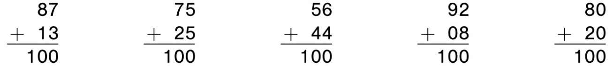

# 第一章 数的魔法

1 + 2 + 3 + 4 + ··· + 100 = 5050

## **数的模式**

        数学的研究始于数。学校里，在我们学习如何用文字、数字或物理对象来计算和表示数之后，我们花了很多年的时间学习通过加、减、乘、除和其他算术过程来操纵数。然而，如果我们只是从表面看，我们往往不会看到这些数自身拥有能够娱乐我们的魔力。

        让我们从数学家高斯（Karl Friedrich Gauss）孩童时遇到的一个问题开始。高斯的老师让高斯和他的同学们把从1到100所有的数加起来，这是一项繁琐的任务，旨在让学生在老师做其他工作时很忙碌。高斯立即写下了答案：5050，这让他的老师和同学们大吃一惊。他是怎么做到的呢？如下图所示，高斯把1到100分成两行，最上面的数是1到50，51到100写在下面。高斯观察到，50列中的每一列合计为101，所以它们的总和就是50×101，即5050。

        将从1到100的数分成两行；每一对数之和是101。

        高斯最终能成为十九世纪最伟大的数学家，并不是因为他能快速心算，而是因为他能够让数舞蹈。在本章中，我们将探索许多有趣的数型，并开始了解数如何舞蹈。其中一些模型可用于更快速地进行心算，有些模型只是为自己而美丽。

        我们用高斯的逻辑求前100个数之和，但如何求前17或1000或100万个数之和呢？事实上，我们可以用他的逻辑求前n个数之和，其中n可以是任何你想要的数！有些人发现数在能被图像化时不太抽象。我们将1、3、6、10和15称为三角形数，因为我们可以使用这些数量的点创建下面的三角形 （你可能会拒绝接受1个点能构成三角形，但是1被认为是三角形数）。官方定义第n个三角形数是1+2+3+...+n。

        前五个三角形数是1、3、6、10和15

        请注意，当我们将两个三角形并排放置时会发生什么情况？

        矩形中有多少个点？

        两个三角形组成5行6列的矩形，共有30个点。因此，每个原始三角形必然有一半的点数，即15个。同样的论证表明，如果您将两个三角形分成n行并将它们像我们一样放在一起，则形成一个具有n行和n+1列的矩形，其具有n × \(n + 1\)个点（通常更简洁地书写为n\(n+1\)个点）。 结果，我们得出了前n个数的求和公式：

        注意我们刚刚做了什么：我们看到了一个用来为前100个数求和的数学模型，并且能够将其扩展以处理任何相同形式的问题。如果我们需要将1到100万的数加起来，我们可以分两步进行：将1,000,000乘以1,000,001，然后除以2。

        一旦你找出一个数学公式，经常也会发现其他公式。例如，如果我们对最后一个等式的两边加倍，则可以得到前n个偶数之和的公式：

$$
2 + 4 + 6 + ··· + 2n = n(n + 1)
$$

        但是如何求前n个奇数之和呢？让我们一起看看这些数告诉了我们什么。

        前n个奇数的总和是多少？

        右边的数是平方数：1×1、2×2、3×3等。不难发现前n个奇数的总和似乎是n×n，通常写成n2。但我们怎么能确定这并非一时的巧合呢？我们将在第6章看到推导这个公式的方法，但是这样一个简单的模型应该有一个简单的解释。我最喜欢的证明再次使用了点数策略，并提醒我们为什么像25这样的数被称为正方形数。为什么前5个奇数之和是52？看看下面5×5的正方形的图片。

        正方形中有多少个点？

        这个正方形有5×5=25个点，但我们以另一种方式来计算点数。从左上角的1个点开始。它被3个点、5个点、7个点、9个点围绕。 所以，

$$
1 + 3 + 5 + 7 + 9 = 5^2
$$

        如果我们从一个n×n的正方形开始，那么我们可以将它分解成尺寸为1、3、5、...\(2n-1\)的n个L形区域。当用这种方式观察时，我们得到一个表示前n个奇数总和的公式：

$$
1 + 3 + 5 + ... + (2n - 1) = n^2
$$


在本书随后的章节里，我们将看到不同的数点方法（以及回答同一问题的两种不同方式）如何在高等数学中产生一些有趣的结果。但它也可以用于理解初等数学。例如，为什么3 × 5 = 5 × 3？我敢肯定你从来没有对这种说法提出过质疑，因为打小时候你就被告知，乘法顺序并不重要（数学家说两个数相乘，其先后顺序可交换）。但是为什么3个装有5个弹珠的口袋与5个装有3个弹珠的口袋，弹珠的总量相等呢？解释很简单：如果你只是在3×5的矩形中计算点数，一行一行地数，我们看到3行，每行5个点，总共3 × 5个点。另一方面，我们也有5列，每列3个点，所以也有5 × 3个点。


       让我们应用奇数和的模型来寻找更美丽的模型。如果我们的目标是让数跳舞，那么你可能会说我们即将做一些平方舞。

        请仔细查看这个有趣的等式金字塔：

        你看到了什么样的模型？每行中数的个数统计起来十分容易：3、5、7、9、11……。接下来是一个意外的模型：每行的第一个数是什么？从前5行\(1、4、9、16、25）来看，它们似乎都是平方数。为什么呢？我们来看第5行。第5行之前出现了多少数？如果我们统计前面四行中的数，我们得到3 + 5 + 7 + 9。为了得到第5行的第一个数，我们只需给这个和加1。这样我们实际得到的是前5个奇数的和，我们现在知道它是52。

        现在让我们不通过求和的方式来验证第五个等式。试想一下高斯会怎么做？如果我们暂时忽略该行开头的25，则等号左边剩下的5个数，每个数比右边对应的数少5。

                                                                          比较第5行的左侧和右侧

        因此，右边五个数的和比左边相应5个数的和大25。但这个差由最左边的25补上了，因此，正如承诺的，等式左右实现了总和平衡。通过相同的逻辑和一点代数，可以证明这种模型将无限期地继续下去。


现在向希望了解代数知识的人，做进一步的解释。行 $$n$$ 之前是$$3 + 5 + 7 +···+ (2n–1) = n^2 - 1$$个数，所以等式的左边必须以 $$n^2$$ 开始，然后 $$n^2+1$$ 到 $$n^2+n$$ 。右侧有 $$n$$ 个连续的数，从 $$n^2+n+1$$ 到 $$n^2+2n$$ 。如果我们暂时忽略最左边的 $$n^2$$ ，我们可以看到右边的n个数都比左边的数大 $$n$$ ，所以它们的差值是 $$n×n$$ ，即 $$n^2$$ 。但最左边的 $$n^2$$ 补偿了这个值，所以等式成立。


        现在来介绍一种新的模式。在前文中，我们使用奇数来制作正方形。现在让我们看看当所有奇数被置于一个大三角形时会发生什么。

        我们看到 $$3 + 5 = 8$$ ， $$7 + 9 + 11 = 27$$ ， $$13 + 15 + 17 + 19 = 64$$ 。数 $$1$$ 、 $$8$$ 、 $$27$$ 和 $$64$$ 有什么共同点？他们是立方数！例如，将第五行中的五个数相加，我们可以得到 $$21 + 23 + 25 + 27 + 29 = 125 = 5 × 5 × 5 = 53$$ 。

        该模型似乎表明，第 $$n$$ 行的总和为 $$n^3$$ 。是否会一直如此呢？是否仅仅是一些奇怪的巧合？为了帮助我们理解这种模型，请查看第1、3和5行的中位数。您看到了什么？立方数1、9和25。第2行和第4行没有中位数，但围绕中位的是3和5，平均数为4。而15和17的平均数为16。让我们看看该如何利用这种模型。

        再看第5行。注意，这五个数以25为中心对称，我们不需要将它们相加便可知总和为 $$5^3$$ 。由于这五个数的平均值为52，因此它们的和必然是 $$5^2 + 5^2 + 5^2 + 5^2 + 5^2 = 5 × 5^2$$ ，也就是 $$5^3$$ 。同样，第4行四个数的平均值是 $$4^2$$ ，所以它们和必然是 $$4^2$$。使用一点代数知识（在这里我们没有使用），你可以证明第n行n个数的平均值是 $$n^2$$ ，所以它们的总和必是$$n^3$$ ，正如预期的一样。

        既然我们在谈论立方数和平方数，我忍不住要向你展示更多的模型。当你从 $$1^3$$ 开始，将立方数相加时，你所得到的和会是什么样呢？

                                                                                       这些立方数的和都是平方数

       当我们开始为立方数求和时，我们得到的和为1、9、36、100、225等，这些都是平方数。他们可不是普通的平方数，它们是1、3、6、10、15等的平方，这些都是三角形数！前文中，我们看到它们是连续整数的和，例如， $$1^3 + 2^3 + 3^3 + 4^3 + 5^3 = 225 = 15^2 = (1 + 2 + 3 + 4 + 5)^2$$ 

       换句话说，前n个数的立方之和是前n个数之和的平方。 我们现在还没有准备好证明这一结论，我们将在第6章看到关于它的两个证明。

## **快速心算**

       有些人看着这些数型并说：“好吧，那很好。但是他们有什么好处呢？”大多数数学家可能会像任何一位艺术家一样回应：美丽的图案除了它的美丽之外不需要任何理由。随着我们对数型的理解越深入，它就越美丽。不过，有时这些模型可能会带来很实际的应用。

       我很高兴在我年轻时发现一个简单的数型（即使我不是第一个发现的人）。当时，我在和为20的几组数（比如10和10，或者9和11）中，寻找乘积最大的一组。看起来当两个数都等于10时，乘积最大，通过下面的列表我们可以确认这一点。

       这个模型很明显：随着两个数相差越来越大，它们的乘积变得越来越小。它们会比100少多少呢？ 1、4、9、16、25……，即 $$1^2$$、 $$2^2$$、 $$3^2$$、 $$4^2$$、 $$5^2$$ 等。这种模型总是起作用吗？我决定尝试另一个例子，通过查看和为26的数。

       再一次，当我们选择两个相等的数时，我们得到最大的乘积，然后积减少1，然后是4，然后是9，依此类推。通过另外几个例子，我确信这种模式是正确的（稍后我会告诉你这背后隐藏的代数知识）。然后，我看到了这种模式可以被用来更快地求一个数的平方。

       假设我们想要求13的平方。我们不是直接执行13 × 13，而是先计算较容易的10 × 16 = 160。这几乎就是答案，但是由于我们将两个因子分别加减了3，这个值与真正的答案还差32。因此， $$13^2 = (10 × 16) + 3^2 = 160 + 9 = 169$$ 

       我们来试试另一个例子。尝试使用这种方法求98 × 98。我们将一个因子增加2，另一个因子减少2，将他们的乘积加上22。新的算式是， $$98^2 = (100 × 96) + 2^2 = 9600 + 4 = 9604$$ 。

       个位是5的数求平方特别简单。当两个因子分别增加和减少5后，我们用来相乘的都是整十数。例如

$$35^2 = (30 × 40) + 5^2 = 1200 + 25 = 1225$$ 

$$55^2 = (50 × 60) + 5^2 = 3000 + 25 = 3025$$ 

$$85^2 = (80 × 90) + 5^2 = 7200 + 25 = 7225$$ 

       现在尝试计算 $$59^2$$ 。使用相同的办法，你得到 $$59 × 59 = (60 × 58) + 1^2$$ 。但是如何心算60 × 58呢？一句话：从左至右。让我们先把个位的0忽略，从左开始计算6 × 58。现在6 × 50 = 300，6×8 = 48。将两者加起来等于348。这样60 × 58 = 3480，进一步 $$59^2 = (60 × 58) + 1^2 = 3480 + 1 = 3481$$ 。


现在使用代数方法解释为什么这个方法可行（在第二章读到平方差时，你也许会想重读这一段）。

 $$A^2 = (A + d)(A − d) + d^2$$ 

这里我们求A的平方，d是A和最容易做乘法的数的差（当然d取任意值，该公式都成立）。例如，求59的平方时，A=59，d=1。所以这个公式告诉你去计算 $$(59 + 1) × (59 – 1)+ 1^2$$ ，正如前文所做的计算一样。


       一旦你熟悉了如何求两位数的平方，你可以使用同样的方法来求三位数的平方。例如，如果你知道12 × 12 = 144，那么

$$
112^2= (100 × 124) + 12^2 = 12400 + 144 = 12544
$$

       类似的方法可用于求任意两个接近100的数的乘积。当你第一次看到该方法时，它看起来像纯粹的魔法。看看104 × 109。在每个数旁边，我们写下它和100的差距，如下图所示。 现在将第二个差距添加到第一个数，这将是104 + 9 = 113。然后将两个差距相乘，即104 + 9 = 113。将这些数拼在一起，你的答案神奇地出现了。

       一种用来计算接近100的数的乘积的神奇方法。这里104×109=11336

       我将在第2章向你展示更多这方面的例子和背后的代数知识。但是，当我们谈论这个问题时，让我多说几句关于心算的话。我们花费了大量的时间学习笔算，但是很少的时间学习如何在你的头脑中做数学。然而，在大多数实际情况下，你更可能需要心算而不是笔算。对于大多数大型计算，你将使用计算器来获得确切的答案，但你在阅读营养标签，听取演讲或听取销售报告时通常不会使用计算器。对于这些情况，你通常只需要对重要数量进行精确的估算。学校教授的方法适于笔算，但是它们通常不利于心算。

       这里我要介绍一些基本的概念，我本可就此写一本介绍速算技巧的书。我想特别强调的一个技巧是从左到右来计算。心算是一个不断简化的过程。你从一个难题开始，将其简化为更简单的问题，直到最后得出答案。

### **心算加法**

       请思考314+159（我未将问题写成竖式，这样免得你下意识的用笔算的方式来计算）。从314开始，先加100以使得问题简单化，这样问题变成：414+59；再将50和414加起来会进一步简化问题464+9。

       这就是心算的本质。除此以外，还有一个偶尔会用到的策略——我们可以将比较难的加法先转换成比较容易的减法。这在我们计算价格时会经常遇到。譬如，让我们计算：

$23.58 + $8.95

       既然$8.95比$9少5分，我们就先将$9加到$23.58，然后减去5分。这样问题就简化了：

$32.58 − $0.05 = $32.53

### **心算减法**

       对于心算减法最重要的概念就是_**多减一些**_。比如，相比直接减9，先减10后加1会更容易一些。比如，

83 - 9 = 73 + 1 = 74

       减39时，先减40再加1会更简单。

83 − 39 = 43 + 1 = 44

       当做两位或更多位数的减法时，关键的想法是使用补数（你稍后会因此赞扬我）。一个数的补数是它到下一个整十或整百数的距离。对一位数，这是到10的距离（例如，9的补数是1）。对于两位数，这是到100的距离。查看以下几对和为100的数。你注意到了什么？

### 和为100的互补数

       我们说87的补数是13，75的补数是25，依此类推。相反，13的补数是87，25的补数是75。从左到右查看每个算式，你会注意到（最后一个问题除外），最高位的和为9，最低位和为10。例外情况是以0结尾的数（如最后一个算式）。例如，80的补码是20。

       让我们应用补数策略来计算1234 - 567。当然，如果要对这个问题做笔算的话，那将失去不少乐趣。一旦我们使用了补数，难解的减法问题就会变成了简单的加法问题！要减去567，我们首先减去600。这很容易做到，特别是如果你从左到右思考：1234 - 600 = 634。但是你已经减去了太多。多减了多少呢？600和567的差是多少？这与67和100之间的差相同，即33。这样

1234 − 567 = 634 + 33 = 667

注意：我们刚刚做的加法没有“进位”，因此特别容易。当我们使用补数做减法时，最后一步的加法大多数情况不会遇到“进位”。

三位数的补数和两位数有类似的性质

### 和为1000的三位互补数

       对大部分问题（数的最低位不为0），除最低位之和为10外，其余对应位之和为9。例如789 + 211，7+2=9、8+1=9、9+1=10。当情况发生变化时，策略的调整也很简单。例如，当地熟食店中我喜爱的三明治售价$6.76。如果我付了$10.00，我将得到多少找零？答案就在676的补数324中。只要移动小数点，我们便可知找零是$3.24。


当我购买三明治时，我不禁注意到价格和找零都是平方数（262=676和182=324）。 （附加问题：还有一对平方数加起来可以达到1000。你能找到它们吗？）


### **心算乘法**

       当你记下乘法表之后，你至少可以近似地进行心算乘法。下一步是掌握（不是熟记）一位数乘两位数。核心概念是从左往右。例如计算8 × 24，你应该先算8 × 20，然后加上8 × 4：

$$
8 × 24 = (8 × 20) + (8 × 4) = 160 + 32 = 192
$$

       一旦你掌握了这些，便可以练习一位数乘3位数。事情变得稍微难了一点，因为头脑中需要记忆的数变多了。这里的关键是逐渐地将这些数加起来，这样你就不需要记住太多的数。例如，算456 × 7时，你先计算2800 + 350，然后在加上42。

       一旦你掌握了这种规模的问题，那么就该开始处理两位数乘两位数的问题了。对我而言，这是乐趣的开始，因为通常有许多不同的方式可以解决这些问题。通过多种方式解决问题，您可以检查您的答案——同时陶醉于算术的一致性！我将用一个例子来说明所有这些方法，32 × 38。

       最熟悉的方法（与您在纸上做的最相似）是添加法，它可以应用于任何问题。在这里，我们将一个数（通常是较小的数）分成两部分，然后将每部分乘以另一个数，并将结果相加。 例如，

$$
32 × 38 = (30 + 2) × 38 = (30 × 38) + (2 × 38) = ···
$$

       现在如何计算30 × 38呢？让我们先算3 × 38，然后在尾部添加0。3 × 38 = 90 + 24 = 114, 所以30 × 38 = 1140。接下来 2 × 38 = 60 + 16 = 76, 所以

$$
32 × 38 = (30 × 38) + (2 × 38) = 1140 + 76 = 1216
$$

       使用加减法的挑战是需要你在进行单独运算时，暂时要记住一个大数（譬如1140或1280）。这可能会有难度。通常情况下，对于两位数乘法我最喜欢分解因子法。当一个两位数可以被拆分成两个一位数之积时，我们可以使用这种方法。在我们的例子中，我们看到32可以被拆成8×4。因此，

$$
38 × 32 = 38 × 8 × 4 = 304 × 4 = 1216
$$

       如果我们将32拆成4 × 8，我们得到38 × 4 × 8 = 152 × 8 = 1216，但是我更喜欢先用较大的数去乘另外一个两位数，这样接下来只要再乘一个较小的数即可。


 分解因子法也适用于11的乘法，因为有一个乘以11特别简单的技巧：只需将高低位求和并和放在两者之间即可。 例如，53 × 11，我们看到5 + 3 = 8，所以答案是583。27 × 11？ 由于2 + 7 = 9，答案是297。如果两数位的和大于9，该怎么办？在这种情况下，我们插入和的最低位，在最高位上增加1。例如，要计算48×11，因为4 + 8 = 12，答案是528。同样，74×11 = 814。当一因子是11的倍数时，我们也可使用分解因子法。例如，

$$74 × 33 = 74 × 11 × 3 = 814 × 3 = 2442$$ 


      另一个有趣的两位数相乘的方法我称之为接近法。当两个数十位相同时，你可以使用。当你第一次看到它时，它似乎非常神奇。例如，你能够相信吗？

$$
38 × 32 = (30 × 40) + (8 × 2) = 1200 + 16 = 1216
$$

       这个计算非常简单，特别是当个位之和是10时（例子中，十位都是3，个位之和是10）。另外一个例子

$$
83 × 87 = (80 × 90) + (3 × 7) = 7200 + 21 = 7221
$$

       即使个位之和不是10，计算也可以很简单。例如41 × 44。如果你把较小一个数减少1（抵达最近的整十数40），接着将较大的数增加1。接下来，

$$
41 × 44 = (40 × 45) + (1 × 4) = 1800 + 4 = 1804
$$

       对34 × 37，如果你将34减少4（抵达最近整十数30），接着将其乘以37 + 4 = 41，最后加上4 × 7，我们得到

$$
34 × 37 = (30 × 41) + (4 × 7) = 1230 + 28 = 1258
$$

       同样的方法，我们在前文看到的104 × 109只不过是同样方法的一次应用。

$$
104 × 109 = (100 × 113) + (04 × 09) = 11300 + 36 = 11,336
$$

       有些学校要求学生背会20以内的乘法表。你可以使用同样的方法快速计算，而不是去死记硬背乘法表。

$$
17 × 18 = (10 × 25) + (7 × 8) = 250 + 56 = 306
$$

       为什么这种神奇的方法会有效呢？我们必须使用到一些代数知识来解释，我会在第二章就这一知识点做详细说明。一旦我们有了代数知识，我们可以发现新的计算方法。例如，我们会看到为什么最后一个问题可以被如此解决：

$$
18 × 17 = (20 × 15) + ((-2) × (-3)) = 300 + 6 = 306
$$

       说到乘法表，请查看下面的一位数乘法表。这里有一个会吸引住小高斯的问题：乘法表中所有数之和是多少？花点时间，看看你能否想出一个优雅的解法。我将在本章结束时提供答案。

### **心算估算和心算除法**

       让我们从一个学校里不会教授的非常简单的问题开始：

1. 两个三位数相乘，你能立即说出结果是几位数吗？
2. 当一个4位数和一个5位数相乘时，结果会是几位数？

        我们花了很多时间在学校学习中如何求解乘法或除法问题，却很少花时间考虑答案的重要方面。然而，知道答案的近似大小比知道最后几位甚至是第一位数字更重要（知道答案以3开头是没有意义的，直到你知道答案是接近30,000还是300,000或3,000,000）。问题a）的答案是五位或六位数。这是为什么？最小答案是100 × 100 = 10,000，其中有五位数字。最大答案是999 × 999，严格小于1000 × 1000 = 1,000,000，其中有七位数字（但非常勉强！）。由于999 × 999较小，所以它只能有六位数字（当然，你可以很容易得出最后一个问题的答案： $$999^2 =(1000 × 998)+ 1^2 = 998,001$$ ）。因此，两个3位数的乘积必须有5或6位数。

                                                                 乘法表中所有100个数的和是多少？

        第二个问题的答案是8或9。为什么？最小的四位数是1000，可被记作103\(1后面3个0）。最小的5位数是10000=104。所以，最小的乘积是103 × 104 = 107,是一个8位数（107是怎么得来的呢（103 × 104 = \(10 × 10 × 10\) × \(10 × 10 × 10 × 10\) = 107）？最大的乘积比104 × 105 = 109（这是一个10位数）小一点，所以是9位数。

        通过应用这一逻辑，我们可以得出一个结论：**m位数和n位数相乘，乘积是m+n或m+n-1位数**。

        通常情况下，只需简单地查看一下相乘的两个因子的最高位，我们便可以得知乘积是几位数。如果最高位的乘积是10或者更大，则乘积必然是m + n位数（比如，271 × 828，最高位的乘积是2 × 8 = 16，所以答案是6位数）。如果最高位的乘积不大于4，则结果是m + n - 1位数。例如，314 × 159就是一个5位数。如果最高位乘积是5、6、7、8或9，则需要进一步的判断。譬如222 × 444是5位数, 但234 × 456却是6位数（两个乘积都非常接近100,000，这确实很麻烦）。

        把这条乘法规律颠倒过来，我们可以得出一条简单的除法规律：**一个m位数被一个n位数除，商是m-n或者m-n+1位数**。

        例如，一个9位数被5位数除，商是4位或者5位数。除法用来确认最终答案的办法要比乘法简单。我们只需要比较除数和被除数的最高位，而不必去乘或者除它们。如果被除数的最高位小于除数最高位，则商是m-n位数；反之，则商是m-n+1位数。如果最高位相同，则使用相同的方法比较接下来的一位。譬如，314159265除以12358，商是一个5位数，当我们将除数换成62831时，商是一个4位数。161803398除以14142的商是5位数，因为16&gt;14。

        我不想详细介绍心算除法的过程，因为它类似于笔算（实际上，任何做除法笔算的方法都会要求你从左往右计算）。这里只介绍一些可以使得事情简单的便捷方法。

        当除数是5（或者最低位是5）时，你可以将除数和被除数先同时乘以2.比如：

$$
34 ÷ 5 = 68 ÷ 10 = 6.8
$$

$$
123 ÷ 4.5 = 246 ÷ 9 = 82 ÷ 3 = 27\frac{1}{3}
$$

        将除号前后两个数乘以2后，你会注意到246和9都是3的倍数（我将在第三章介绍更多相关内容），这样通过将它们分别先除以3，问题得以进一步简化。


请看从1到10各个数的倒数:

1/2 = 0.5, 1/3 = 0.333 . . . , 1/4 = 0.25, 1/5 = 0.2

1/6 = 0.1666 . . . , 1/8 = 0.125, 1/9 = 0.111 . . . , 1/10 = 0.1

以上小数，要么是有限小数，要么从小数点右侧第二位开始重复。但是1/7是个例外，它在小数点之后，以六位为一组重复:

1/7 = 0.142857142857 . . .

（造成这种差别的原因是其它9个数能够除尽10、100、1000、9、90或99中的一个。而类似的数直到999999才能够被7除尽。）如果你将1/7循环节上的每一位写在一个圆环上，神奇的一幕将会出现。

最神奇的一点是，其余以7为分母的小数可以通过从一个合适的起点绕行这个圆环求得

1/7 = 0.142857 142857 . . . , 2/7 = 0.285714 285714 . . . ,

3/7 = 0.428571 428571 . . . , 4/7 = 0.571428 571428 . . . ,

5/7 = 0.714285 714285 . . . , 6/7 = 0.857142 857142 . . .


        让我们以我在之前提出的一个问题来结束本章，10以内乘法表中所有数之和是多少？和前100个数求和一样，初看起来，这个问题貌似很吓人。通过对数之舞美丽的模式有了深入理解之后，我们有更好的机会来找到这个问题的美丽答案。

        我们从第一行的数开始。正如高斯（或是我们的三角形数，或是简单的加法）告诉我们的:

$$
1 + 2 + 3 + 4 + 5 + 6 + 7 + 8 + 9 + 10 = 55
$$

        第二行的和是多少呢？刚好是第一行的两倍

$$
2 + 4 + 6 + ··· + 20 = 2 × (1 + 2 + 3 + ··· + 10) = 2 × 55
$$

        同理，第三行的和是 3 × 55。 使用相同的逻辑，我们可以得到最终的和是

$$
(1 + 2 + 3 + ··· + 10) × 55 = 55 × 55 = 55^2
$$

        结果你应该能够心算得出 —— 3025!

